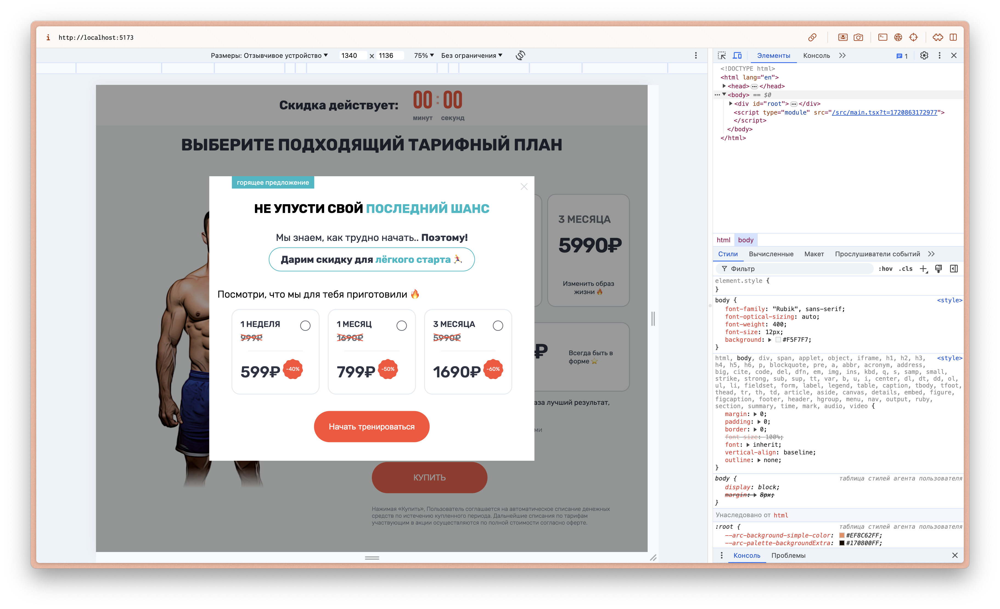

# Frontend Subscription SPA



## Overview

This project is a single-page application (SPA) designed to showcase various subscription plans. It was built using modern web technologies including React, TypeScript, Zustand, SCSS, SCSS Modules, and GSAP for animations. The project was developed as part of an application for a web engineer position on hh.ru and was completed within 1.5 weeks.

## Table of Contents

1. [Installation](#installation)
2. [Technologies Used](#technologies-used)
3. [Project Structure](#project-structure)
4. [Features](#features)
5. [Usage](#usage)
6. [Deployment](#deployment)
7. [Contributing](#contributing)
8. [License](#license)

## Installation

To get started with this project, clone the repository and install the necessary dependencies:

```bash
git clone https://github.com/yourusername/your-repo.git
cd your-repo
npm install
```

## Technologies Used

- **React**: A JavaScript library for building user interfaces.
- **TypeScript**: A typed superset of JavaScript that compiles to plain JavaScript.
- **Zustand**: A small, fast, and scalable bearbones state-management solution.
- **SCSS**: A CSS preprocessor that adds power and elegance to the basic language.
- **SCSS Modules**: Modular and reusable styles using SCSS.
- **GSAP**: A powerful JavaScript library for creating animations.

## Project Structure

The project structure is organized as follows:

```plaintext
├── public
│   ├── index.html
│   └── ...
├── src
│   ├── assets
│   │   ├── _mixins.scss
│   │   ├── colors.scss
│   │   ├── global.scss
│   │   └── Main.module.scss
│   ├── components
│   │   ├── Container
│   │   │   └── Container.tsx
│   │   ├── Navbar
│   │   │   └── Navbar.tsx
│   │   ├── Popup
│   │   │   └── Popup.tsx
│   │   ├── Tiles
│   │   │   └── Tiles.tsx
│   │   └── Timer
│   │       └── Timer.tsx
│   ├── App.tsx
│   ├── main.tsx
│   ├── TilesData.ts
│   ├── TimeoutStore.ts
│   └── vite-env.d.ts
├── .eslintrc.cjs
├── .gitattributes
├── .gitignore
├── .prettierrc
├── index.html
├── LICENSE
├── package-lock.json
├── package.json
├── README.md
├── tsconfig.app.json
├── tsconfig.json
├── tsconfig.node.json
└── vite.config.ts
```

## Features

- **Display Subscriptions**: Displays a list of subscription plans with relevant information.
- **State Management**: Uses Zustand for state management.
- **Animations**: Utilizes GSAP for smooth animations.
- **SCSS Modules**: Modular and maintainable styling using SCSS Modules.
- **TypeScript**: Strongly-typed codebase for better developer experience and fewer runtime errors.

## Usage

To start the development server, run:

```bash
npm start
```

The application will be available at `http://localhost:3000`.


## Deployment

To build the project for production, run:

```bash
npm run build
```

The built files will be in the `dist` directory. You can then deploy these files to a static server.

## Contributing

If you want to contribute to this project, please follow these steps:

1. Fork the repository.
2. Create a new branch (`git checkout -b feature-branch`).
3. Make your changes.
4. Commit your changes (`git commit -m 'Add some feature'`).
5. Push to the branch (`git push origin feature-branch`).
6. Create a new Pull Request.

## License

This project is licensed under the MIT License. See the [LICENSE](LICENSE) file for details.

---

This README provides a comprehensive guide for understanding, installing, using, and contributing to your project. Feel free to customize it further based on your specific needs and details.
